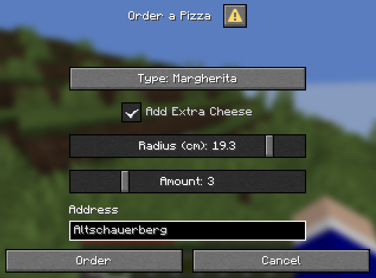

# PaperUI
A Java/Kotlin library for creating user interfaces on Paper servers


## How to use
Either: Add PaperUI as a plugin to your Paper server and add PaperUI to your dependencies in `plugin.yml` or `paper-plugin.yml`\
Or: Include PaperUI as in your plugin

### Maven
```xml
<repositories>
    <repository>
        <id>DiruptioPublic</id>
        <url>https://repo.diruptio.de/repository/maven-public</url>
    </repository>
</repositories>
```
```xml
<dependencies>
    <dependency>
        <groupId>de.fabiexe</groupId>
        <artifactId>PaperUI</artifactId>
        <version>VERSION</version>
    </dependency>
</dependencies>
```

### Gradle
```kotlin
repositories {
    maven("https://repo.diruptio.de/repository/maven-public")
}
```
```kotlin
dependencies {
    compileOnly("de.fabiexe:PaperUI:VERSION")
}
```


## DialogUI
A dialog user interface can have properties/inputs, buttons and action buttons.
Example:\


### Kotlin
```kotlin
enum class PizzaType {
    MARGHERITA, FUNGHI, PROSCIUTTO
}

fun create(audience: Audience) = DialogUI(audience).apply {
    title("Order a Pizza")
    val type by enumProperty("Type", PizzaType::class.java)
    val extraCheese by booleanProperty("Add Extra Cheese")
    val radius by doubleProperty("Radius (cm)", 15.0, 20.0)
    val amount by integerProperty("Amount", 1, 10, 1)
    val address by stringProperty("Address")

    actionButton("Order") {
        var pizza = "$type with radius ${radius}cm"
        if (extraCheese.get()) {
            pizza += " with extra cheese"
        }
        val message = "We will deliver $amount $pizza to $address"
        audience.sendMessage(Component.text(message))
    }
    actionButton("Cancel")
}
```
```kotlin
fun doSomething() {
    create(player).open()
}
```


### Java (short)
```java
public class OrderDrugsUI {
    public static DialogUI<Audience> create(@NotNull Audience audience) {
        DialogUI<Audience> ui = new DialogUI<>(audience);

        ui.title("Order drugs");

        Property<DrugType> type = ui.enumProperty("Type", DrugType.class);
        Property<Double> dosis = ui.doubleProperty("Dosis (%)", 50, 120, 100);
        Property<Integer> amount = ui.integerProperty("Amount", 1, 10);
        Property<String> address = ui.stringProperty("Address");

        ui.actionButton("Order", () -> {
            String drug = type.get() + " with dosis " + dosis.get() + "%";
            String message = "We will deliver " + amount.get() + " " + drug + " to " + address.get();
            audience.sendMessage(Component.text(message));
        });
        ui.actionButton("Cancel");

        return ui;
    }

    private enum DrugType {
        CANNABIS, COCAINE, HEROIN, FENTANYL
    }
}
```
```java
public void doSomething() {
    OrderDrugsUI.create(player).open();
}
```

### Java (long)
```java
public class OrderCoffeeUI extends DialogUI<Audience> {
    private final Property<CoffeeType> type;
    private final Property<Double> size;
    private final Property<Boolean> milk;
    private final Property<Integer> amount;
    private final Property<String> address;

    public OrderCoffeeUI(@NotNull Audience audience) {
        super(audience);

        title("Order a Coffee");
        type = enumProperty("Type", CoffeeType.class);
        size = doubleProperty("Size (liters)", 0.25, 1, 0.33);
        milk = booleanProperty("Add milk");
        amount = integerProperty("Amount", 1, 10);
        address = stringProperty("Address");

        actionButton("Order", this::order);
        actionButton("Cancel");
    }

    private void order() {
        String coffee = type.get() + " with size " + size.get() + "l";
        if (milk.get()) {
            coffee += " with milk";
        }
        String message = "We will deliver " + amount.get() + " " + coffee + " to " + address.get();
        audience.sendMessage(Component.text(message));
    }

    private enum CoffeeType {
        COFFEE, ESPRESSO, CHOCOLATE_COFFEE, DOUBLE_CHOCOLATE_COFFEE
    }
}
```
```java
public void doSomething() {
    new OrderCoffeUI(player).open();
}
```
